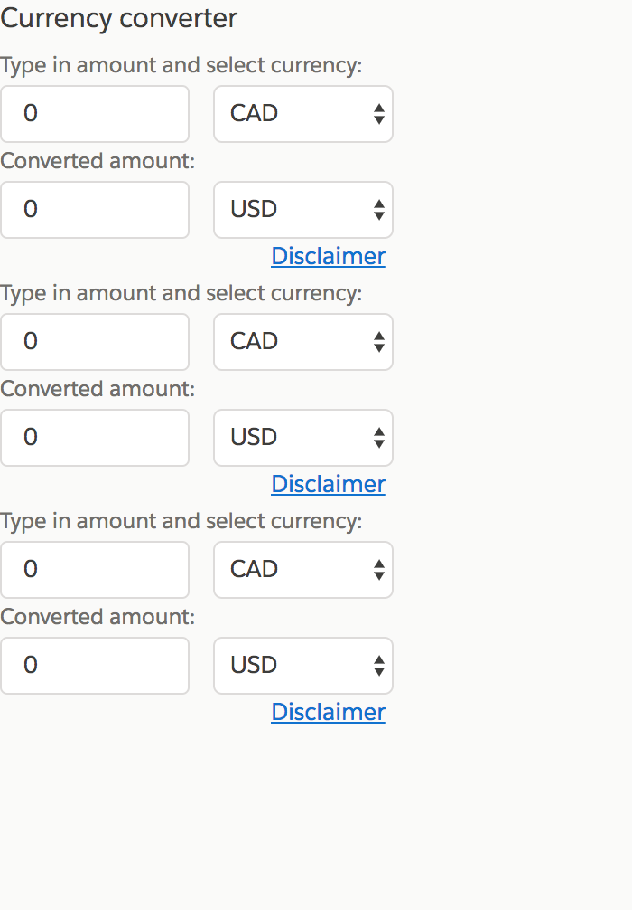
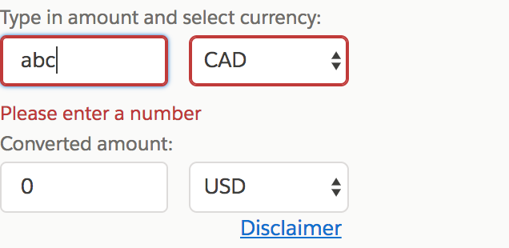
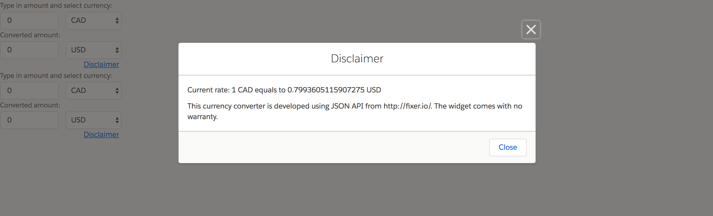

# CurrencyConverter
This project was generated with [Angular CLI] version 1.6.2.

## Online Demo
https://iriszhucode.github.io/currency-converter/

## Development server
1.Install angular-cli and all the dev dependencies via npm.

2.Run ng serve for a dev server. 

3.Navigate to http://localhost:4200/. 

## CSS framework
This project used Lightning Design System as CSS framework 

## Browser compatibility
This web app has been tested on IE11, latest Chrome, Firefox and Safari in production environment.

## Touch devices
This web app has been tested on iPhone5+ and iPad.

## Form validation
Input element only accept a number value. Otherwise an error message would be displayed under the input element.

## Disclaimer
After clicking on the disclaimer link, a modal containing current currency and information of api will show up.

